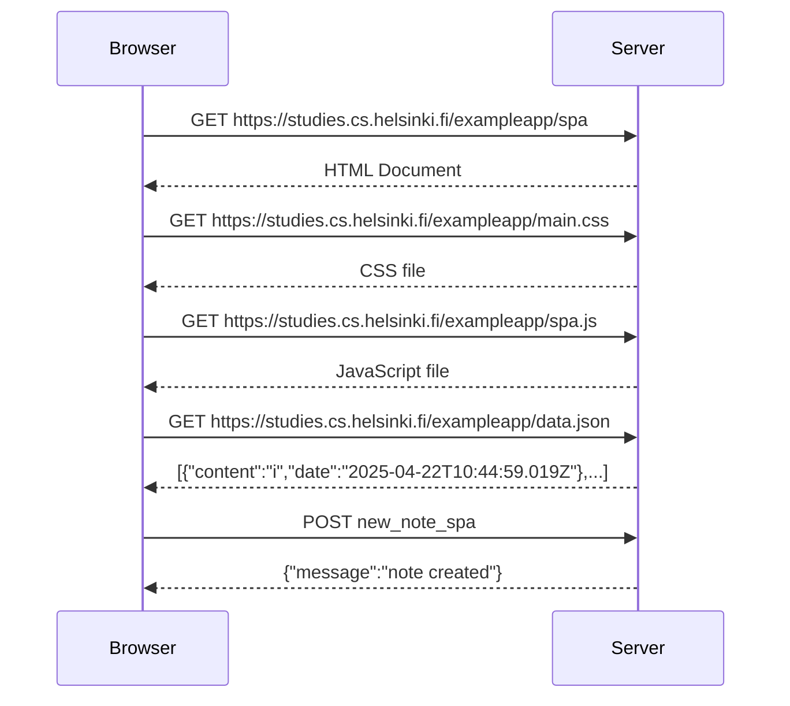

```mermaid
sequenceDiagram
    Browser->>Server: GET https://studies.cs.helsinki.fi/exampleapp/spa
    Server-->>Browser: HTML Document
    Browser->>Server: GET https://studies.cs.helsinki.fi/exampleapp/main.css
    Server-->>Browser: CSS file
    Browser->>Server: GET https://studies.cs.helsinki.fi/exampleapp/spa.js
    Server-->>Browser: JavaScript file
    Browser->>Server: GET https://studies.cs.helsinki.fi/exampleapp/data.json
    Server-->>Browser: [{"content":"i","date":"2025-04-22T10:44:59.019Z"},...]
    Browser->>Server: POST new_note_spa
    Server-->>Browser: {"message":"note created"}

```
